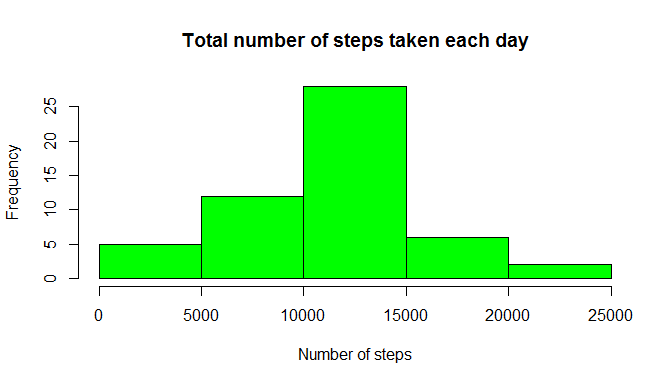
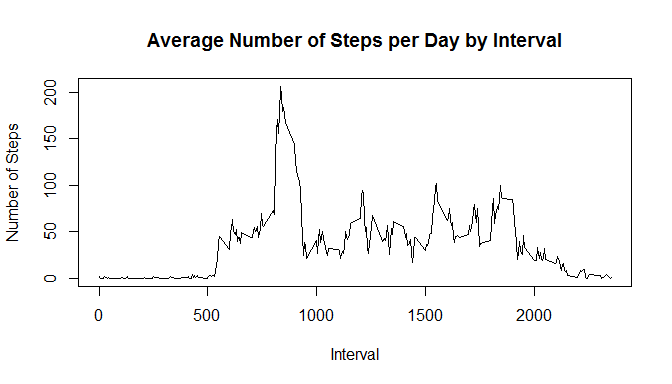
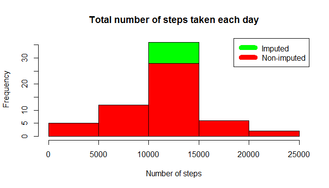

# Reproducible Research: Peer Assessment 1


## Data
This project uses the data provided along with  the assignment.
 Data : [Activity Monitoring Data](https://d396qusza40orc.cloudfront.net/repdata%2Fdata%2Factivity.zip)

 The variables included in this dataset are:

 * **steps**: Number of steps taking in a 5-minute interval (missing values are coded as NA)
 * **date**: The date on which the measurement was taken in YYYY-MM-DD format
 * **interval**: Identifier for the 5-minute interval in which measurement was taken
 The dataset is stored in a comma-separated-value (CSV) file and there are a total of 17,568 observations in this dataset.


## Loading and preprocessing the data


```r
if (!file.exists("activity.csv")) {
  unzip("activity.zip")
}

activitydat <- read.csv("activity.csv")
```


## What is mean total number of steps taken per day?


#### 1. Calculate the total number of steps taken per day


```r
StepsPerDay <- aggregate(steps ~ date, activitydat, sum)
```


####2. The Histogram showing the total number of steps taken each day 

```r
hist(StepsPerDay$steps, main = "Total number of steps taken each day", xlab ="Number of steps", col = "green")
```

\


####3. The mean and median of the total number of steps taken per day

The mean of total number of steps taken per day is 


```r
 mean1 <- mean(StepsPerDay$steps)
 mean1
```

```
## [1] 10766.19
```

The median of total number of steps taken per day is 


```r
 median1 <- median(StepsPerDay$steps)
 median1
```

```
## [1] 10765
```

## What is the average daily activity pattern?

#### 1. Time series plot (i.e. type = "l") of the 5-minute interval (x-axis) and the average number of steps taken, averaged across all days (y-axis)


```r
stepsbyinterval <- aggregate(steps ~ interval, activitydat, mean)
```


```r
plot(stepsbyinterval$interval,stepsbyinterval$steps, type="l", xlab="Interval", ylab="Number of Steps",main="Average Number of Steps per Day by Interval")
```

\


#### 2. The 5-minute interval that contains the maximum number of steps is


```r
minterval <- stepsbyinterval[which.max(stepsbyinterval$steps),1]
minterval
```

```
## [1] 835
```


## Imputing missing values

                                              
####1. The total number of missing values in the dataset (i.e. the total number of rows with NAs)

```r
narows <- sum(is.na(activitydat$steps))
narows
```

```
## [1] 2304
```


              
#### 2. The strategy for filling in all of the missing values in the dataset is using the  mean for that 5-minute interval.

####Creating a new dataset that is equal to the original dataset but with the missing data filled in...


```r
cleaned_data <- transform(activitydat, steps = ifelse(is.na(activitydat$steps), stepsbyinterval$steps[match(activitydat$interval, stepsbyinterval$interval)], activitydat$steps))
```

                                                                                                  
                     
                     
####3. Histogram of the total number of steps taken each day and Calculate and report the mean and median total number of steps taken per day. Do these values differ from the estimates from the first part of the assignment? What is the impact of imputing missing data on the estimates of the total daily number of steps?


#### 3.1 Calculate the total number of steps taken per day using the imputed data.


```r
StepsPerDay2 <- aggregate(steps ~ date, cleaned_data, sum)
```


####3.2 The Histogram showing the total number of steps taken each day 

```r
hist(StepsPerDay2$steps, main = "Total number of steps taken each day", xlab ="Number of steps", col = "green")

hist(StepsPerDay$steps, main = "Total Steps Each Day", col="red", xlab="Number of Steps", add=T)
legend("topright", c("Imputed", "Non-imputed"), col=c("green", "red"), lwd=10)
```

\


####3.3 The mean and median of the total number of steps taken per day

The mean of total number of steps taken per day is 


```r
 mean2 <- mean(StepsPerDay2$steps)
 mean2
```

```
## [1] 10766.19
```

The median of total number of steps taken per day is 


```r
 median2 <- median(StepsPerDay2$steps)
 median2
```

```
## [1] 10766.19
```


####Calculate the difference between the mean and median values for imputed and actual data.

```r
 diffmean <- mean1 - mean2
 
 diffmean
```

```
## [1] 0
```

```r
 diffmedian <- median1 - median2
 
 diffmedian
```

```
## [1] -1.188679
```
 There is not much difference between the mean and median values for imputed and actual data.
 
 
####Calculate the difference in total daily number of steps after imputing the data.


```r
 stepdiff <- sum(StepsPerDay2$steps) - sum(StepsPerDay$steps)
 stepdiff
```

```
## [1] 86129.51
```


## Are there differences in activity patterns between weekdays and weekends?


```r
library(lattice)
 
weekdays <- c("Monday", "Tuesday", "Wednesday", "Thursday", 
              "Friday")
 
cleaned_data$dow = as.factor(ifelse(is.element(weekdays(as.Date(cleaned_data$date)),weekdays), "Weekday", "Weekend"))

stepsbyinterval2 <- aggregate(steps ~ interval + dow, cleaned_data, mean)


xyplot(stepsbyinterval2$steps ~ stepsbyinterval2$interval|stepsbyinterval2$dow, main="Average Steps per Day by Interval",xlab="Interval", ylab="Steps",layout=c(1,2), type="l")
```

\


